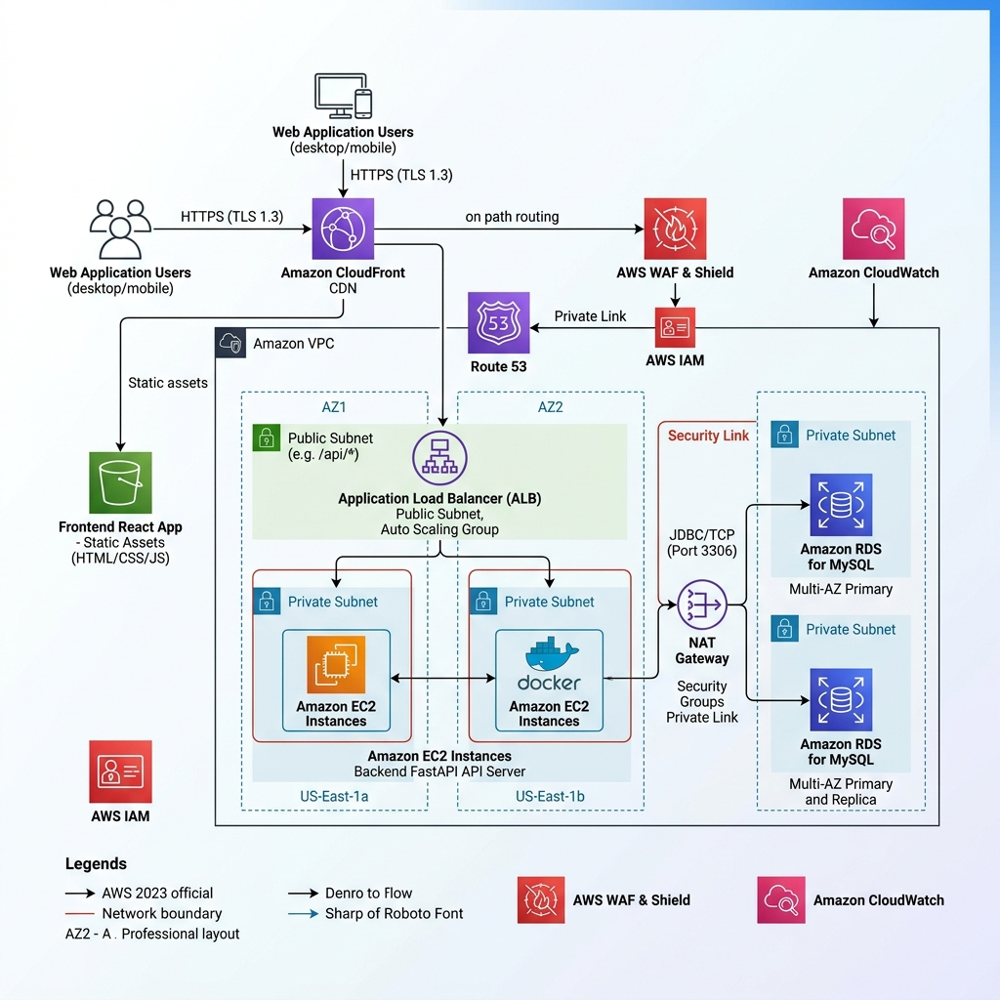
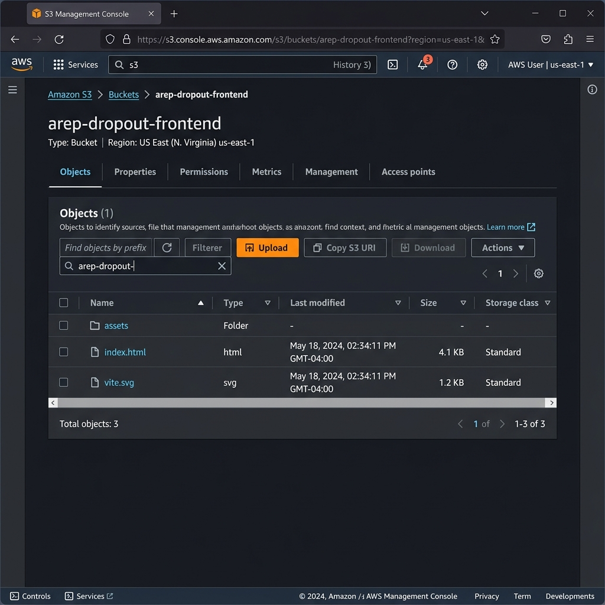
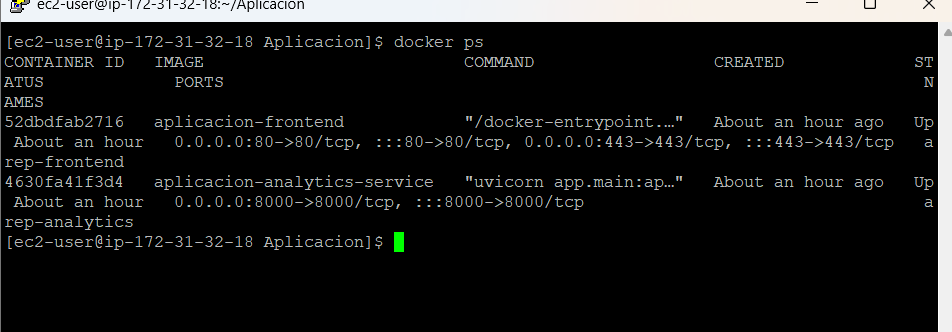
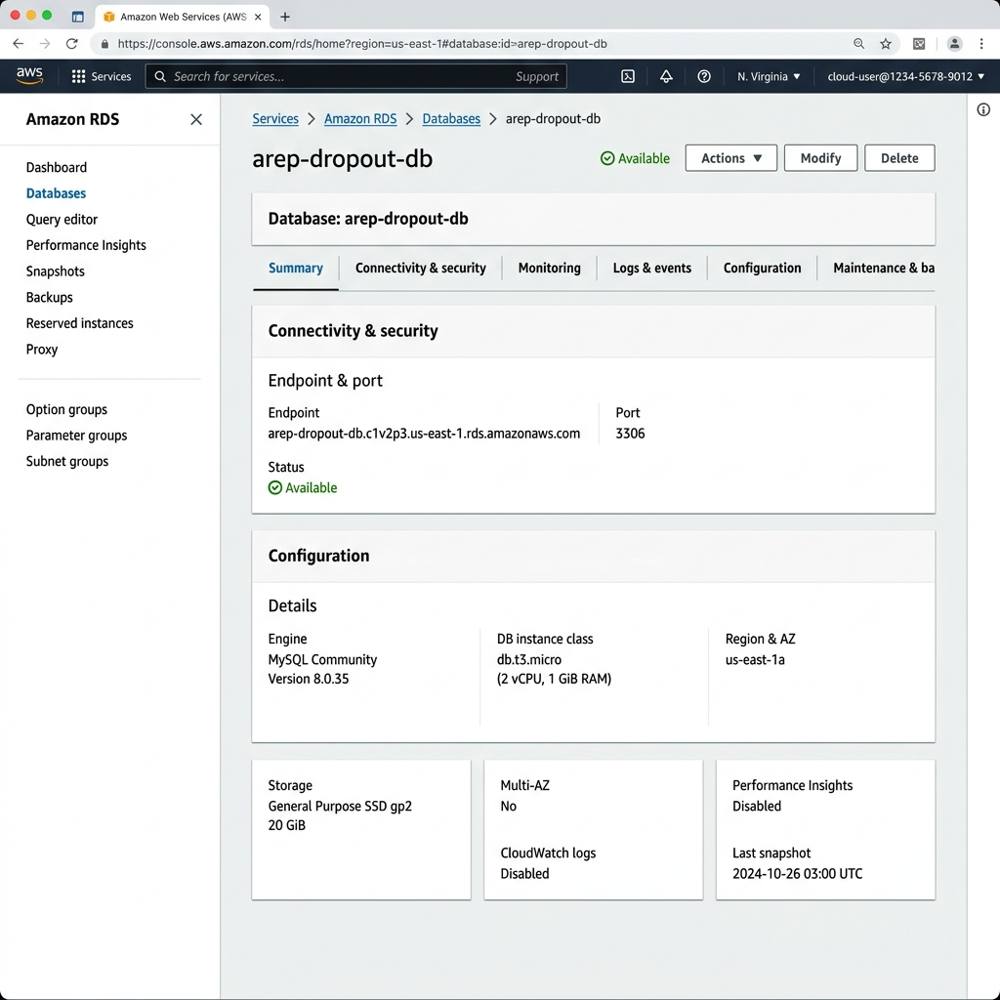

# AREP — Sistema de Predicción Adaptativa de Deserción Estudiantil

> **Autores:** Juan Pablo Nieto Cortés · Juan Sebastián Buitrago Piñeros
> **Institución:** Escuela Colombiana de Ingeniería Julio Garavito
> **Fecha:** Mayo 2026

Sistema de predicción de deserción estudiantil en instituciones de educación superior,
integrado por modelos estadísticos y de aprendizaje automático, análisis de supervivencia
y un panel de visualización web en tiempo real.

---

## Descripción General

El sistema responde tres preguntas institucionales clave:

| Pregunta                                                        | Componente responsable                              |
| --------------------------------------------------------------- | --------------------------------------------------- |
| **¿Quién** tiene mayor probabilidad de abandonar?               | Clasificadores ML (Random Forest, MLP, SVM, DT, LR) |
| **¿Cuándo** es más crítico el riesgo de abandono en la cohorte? | Análisis de supervivencia (Kaplan-Meier)            |
| **¿Por qué** ciertos estudiantes tienen mayor riesgo?           | Hazard Ratios (Cox PH) + Importancia de Variables   |

El umbral de clasificación τ se calibra automáticamente mediante el **índice de Youden**
(`τ* = argmax[Sensibilidad(τ) + Especificidad(τ) − 1]`) y puede ajustarse manualmente
desde el Dashboard según la capacidad de intervención institucional.

---

## Tecnologías

| Capa                   | Tecnología              | Versión  | Justificación                                  |
| ---------------------- | ----------------------- | -------- | ---------------------------------------------- |
| Backend framework      | FastAPI                 | ≥0.110   | Async, tipado con Pydantic, OpenAPI automático |
| ML — clasificadores    | scikit-learn            | ≥1.4     | LR, DT, RF, SVM, MLP en una sola librería      |
| ML — supervivencia     | lifelines               | ≥0.27    | Kaplan-Meier y Cox PH con resumen estadístico  |
| Balanceo de clases     | imbalanced-learn        | ≥0.12    | SMOTE sobre el conjunto de entrenamiento       |
| Procesamiento de datos | pandas + numpy          | estándar | Manipulación de matrices y DataFrames          |
| Frontend framework     | React 18 + TypeScript   | —        | Tipado estático, componentes reutilizables     |
| Gráficos               | Recharts                | ≥2.x     | Declarativo, compatible con React, ligero      |
| Estilos                | Tailwind CSS            | v3       | Utilidades atomizadas, diseño responsivo       |
| Iconos                 | lucide-react            | —        | SVG optimizados                                |
| Bundler                | Vite                    | —        | Build rápido, HMR en desarrollo                |
| Servidor web           | Nginx                   | alpine   | Sirve el build estático y hace proxy a /api/\* |
| Contenedores           | Docker + Docker Compose | —        | Reproducibilidad y despliegue multiplataforma  |

---

## Despliegue y Arquitectura Cloud (AWS)

El sistema adopta un patrón de **Arquitectura de Microservicios** distribuido en la nube, siguiendo principios de escalabilidad y alta disponibilidad.

### 1. Diagrama de Arquitectura


*Descripción: Diagrama que muestra la interacción entre el usuario, el CDN de CloudFront, el almacenamiento de S3 para el frontend y la instancia EC2/Docker para el backend.*

### 2. Capa de Presentación (Frontend)
*   **Tecnología:** React (Vite + TypeScript).
*   **Alojamiento:** Los archivos estáticos se alojan en **Amazon S3**.
*   **Distribución:** Se utiliza **Amazon CloudFront** como CDN para ofrecer acceso seguro vía **HTTPS** (mediante AWS Certificate Manager) y reducir la latencia global.

> **Evidencia de Despliegue Frontend:**
> 

### 3. Capa de Analítica (Backend)
*   **Tecnología:** Python FastAPI.
*   **Contenerización:** Se ejecuta sobre **Docker** en una instancia **Amazon EC2** (Amazon Linux 2023).
*   **Seguridad:** Implementación de certificados SSL con **Certbot (Let's Encrypt)** y DNS dinámico con **DuckDNS**, permitiendo acceso seguro bajo el dominio `no-clases.duckdns.org`.

> **Evidencia de Backend y Contenedores:**
> 

### 4. Capa de Datos
*   **Persistencia:** Utiliza **Amazon RDS for MySQL** para almacenar los resultados históricos de las predicciones y datos institucionales, garantizando la integridad y backups automáticos.

> **Evidencia de Base de Datos:**
> 

### 5. Flujo de Comunicación y Seguridad
1.  **Entrada:** El usuario accede vía HTTPS a CloudFront.
2.  **API Gateway Interno:** El tráfico se redirige a la instancia EC2 mediante un Proxy Inverso (**Nginx**) que orquestra el tráfico entre el puerto 80/443 y el puerto 8000 del backend.
3.  **Seguridad de Red:** Se configuraron **Security Groups** en AWS para restringir el tráfico solo a los puertos necesarios (80, 443, 8000).

---

---

## Estructura del Proyecto

```
Aplicacion/
├── analytics-service/             # Backend Python FastAPI
│   ├── app/
│   │   ├── main.py                # Entrada + CORS + lifespan (auto-entrenamiento)
│   │   ├── core/
│   │   │   └── config.py          # Configuración (Pydantic BaseSettings)
│   │   ├── ml/
│   │   │   ├── preprocessor.py    # DataPreprocessor: carga, limpieza, SMOTE, Z-score
│   │   │   ├── classifiers.py     # 5 clasificadores + cálculo de métricas + Youden
│   │   │   ├── survival.py        # Kaplan-Meier + Cox PH (lifelines)
│   │   │   └── model_manager.py   # Singleton orquestador + umbral adaptativo
│   │   ├── schemas/
│   │   │   └── schemas.py         # Tipos Pydantic para request/response
│   │   ├── services/
│   │   │   ├── analytics_service.py   # KPIs, distribución de riesgo, supervivencia
│   │   │   └── prediction_service.py  # Paginación de estudiantes, predicción individual
│   │   └── api/routes/
│   │       ├── analytics.py       # GET /api/analytics/*
│   │       ├── models.py          # GET /api/models/*
│   │       ├── predictions.py     # GET|POST /api/predictions/*
│   │       └── data.py            # POST /api/data/upload|train, GET /api/data/status
│   ├── data/
│   │   ├── generate_sample.py     # Genera dataset sintético si no hay real
│   │   └── dataset.csv            # ← Coloca aquí el dataset de Kaggle
│   ├── requirements.txt
│   └── Dockerfile
│
├── frontend/
│   ├── src/
│   │   ├── types/index.ts         # Todos los tipos TypeScript del dominio
│   │   ├── services/api.ts        # Cliente REST centralizado (fetch + tipado)
│   │   ├── components/
│   │   │   ├── layout/
│   │   │   │   ├── Sidebar.tsx    # Navegación lateral con rutas
│   │   │   │   └── Navbar.tsx     # Barra superior con título de página
│   │   │   ├── charts/
│   │   │   │   ├── RiskDistributionChart.tsx  # Histograma + semáforo institucional
│   │   │   │   ├── SurvivalCurveChart.tsx     # Curva Kaplan-Meier con área
│   │   │   │   ├── ModelComparisonChart.tsx   # Barras comparativas de métricas
│   │   │   │   └── VariableImportanceChart.tsx # Barras horizontales de importancia
│   │   │   └── ui/
│   │   │       ├── MetricCard.tsx     # Tarjeta de KPI con icono y tendencia
│   │   │       ├── Badge.tsx          # Etiqueta de nivel de riesgo (alto/medio/bajo)
│   │   │       ├── ThresholdSlider.tsx # Control deslizante de umbral τ
│   │   │       └── DatasetUpload.tsx  # Botón de carga de CSV con feedback
│   │   ├── pages/
│   │   │   ├── Dashboard.tsx      # KPIs + curva K-M + distribución + umbral
│   │   │   ├── Students.tsx       # Tabla paginada + filtros por nivel de riesgo
│   │   │   ├── Models.tsx         # Comparativa + selector de métrica + importancia
│   │   │   ├── SurvivalAnalysis.tsx  # K-M + tabla at-risk + tabla Cox
│   │   │   └── Analytics.tsx      # Distribución de probabilidades + tabla Youden
│   │   └── App.tsx                # Router principal (react-router-dom)
│   ├── Dockerfile
│   ├── nginx.conf                 # Proxy /api/* → analytics-service:8000
│   └── package.json
│
├── docker-compose.yml
└── README.md
```

---

## Instalación y Ejecución

### Opción 1: Docker Compose (recomendado para producción)

**Pre-requisito:** Docker Desktop instalado y en ejecución.

```bash
# 1. Navegar al directorio del proyecto
cd "AREP Codigo/Aplicacion"

# 2. (Opcional) Colocar el dataset real:
#    Descargar de Kaggle y renombrar a dataset.csv
#    Ubicar en: analytics-service/data/dataset.csv
#    Si se omite, se usará un dataset sintético automáticamente.

# 3. Construir imágenes y levantar contenedores
docker-compose up --build

# 4. Acceder en: http://localhost
#    API docs:   http://localhost/api/docs
```

Para detener:

```bash
docker-compose down
```

Para reconstruir después de cambios en el código:

```bash
docker-compose up --build --force-recreate
```

---

### Opción 2: Ejecución local (desarrollo)

**Pre-requisitos:** Python 3.11+, Node.js 20+

#### Backend

```bash
cd analytics-service

# Crear y activar entorno virtual (recomendado)
python -m venv venv
source venv/bin/activate          # Linux/macOS
venv\Scripts\activate             # Windows

# Instalar dependencias
pip install -r requirements.txt

# (Opcional) Generar dataset sintético si no tienes el real
python data/generate_sample.py

# Iniciar el servidor de desarrollo
uvicorn app.main:app --reload --port 8000

# Documentación interactiva: http://localhost:8000/api/docs
# Al iniciar, el sistema detecta dataset.csv y entrena automáticamente.
```

#### Frontend

```bash
cd frontend

# Instalar dependencias
npm install

# Iniciar en modo desarrollo (proxy automático a localhost:8000)
npm run dev

# Abrir: http://localhost:5173
```

---

## Dataset

El sistema fue validado con el dataset **"Predict Students' Dropout and Academic Success"**:

| Atributo                 | Valor                                                           |
| ------------------------ | --------------------------------------------------------------- |
| **Fuente**               | Instituto Politécnico de Portalegre (2022) — UCI ML Repository  |
| **DOI**                  | 10.24432/C5MC89                                                 |
| **Registros**            | 4,424 estudiantes universitarios                                |
| **Variables de entrada** | 35 atributos                                                    |
| **Variable objetivo**    | `Target`: Dropout (32.1%) / Graduate (49.9%) / Enrolled (18.0%) |

### Categorías de variables

| Categoría           | Cantidad | Ejemplos                                                |
| ------------------- | -------- | ------------------------------------------------------- |
| Académicas Sem. 1   | 6        | UC aprobadas, calificación promedio, matriculadas       |
| Académicas Sem. 2   | 6        | UC aprobadas, calificación promedio, evaluaciones       |
| Socioeconómicas     | 8        | Becario, deudor, matrícula al día, cualificación padres |
| Demográficas        | 5        | Edad, género, estado civil, nacionalidad                |
| Institucionales     | 6        | Curso, modalidad, vía de admisión, desplazado           |
| Macroeconómicas     | 3        | Desempleo, inflación, PIB                               |
| Calificación previa | 1        | Nota antes del ingreso universitario                    |

### Cómo usar el dataset real

```bash
# 1. Descargar desde Kaggle (requiere cuenta gratuita):
#    https://www.kaggle.com/datasets/thedevastator/higher-education-predictors-of-student-retention

# 2. Renombrar el archivo descargado a dataset.csv

# 3. Colocar en:
analytics-service/data/dataset.csv

# 4. El sistema lo detecta y entrena automáticamente al iniciar.
#    O cargarlo desde el Dashboard usando el botón "Subir Dataset".
```

---

## Pipeline de Datos (DataPreprocessor)

El `DataPreprocessor` (`ml/preprocessor.py`) transforma el CSV crudo en matrices
listas para ML en 6 etapas:

```
CSV crudo
    │
    ▼ Etapa 1: load_and_clean()
    │  • Auto-detecta separador (; o ,)
    │  • Normaliza nombres de columnas (elimina tabs/espacios)
    │  • Mapea Target: "Dropout"→0, "Graduate"→1, "Enrolled"→2
    │
    ▼ Etapa 2: prepare_binary()
    │  • Excluye registros "Enrolled" (resultado desconocido)
    │  • Re-etiqueta: Desertor→1, Graduado→0
    │  • Resultado: ~3,630 registros con outcome definitivo
    │
    ▼ Etapa 3: build_feature_matrix()
    │  • Selecciona 18 variables numéricas + 18 categóricas disponibles
    │  • Imputa faltantes: numéricos→mediana, categóricos→moda
    │
    ▼ Etapa 4: StandardScaler (Z-score)
    │  • fit() SOLO sobre entrenamiento (sin data leakage)
    │  • z = (x - μ_train) / σ_train
    │  • transform() aplicado a entrenamiento, prueba e inferencia
    │
    ▼ Etapa 5: train_test_split (80/20 estratificado)
    │  • Mantiene proporción Desertor/Graduado en ambos conjuntos
    │
    ▼ Etapa 6: SMOTE (solo sobre entrenamiento)
       • Genera instancias sintéticas de la clase minoritaria (Desertor)
       • Resultado: distribución 50/50 en el conjunto de entrenamiento
       • El conjunto de prueba permanece intacto (sin SMOTE)
```

---

## Modelos Implementados

### Clasificadores

| Modelo               | Hiperparámetros principales                          | AUC-ROC típico |
| -------------------- | ---------------------------------------------------- | -------------- |
| **Random Forest** ⭐ | n_estimators=100, max_depth=10, n_jobs=-1            | 0.961          |
| Red Neuronal (MLP)   | hidden=(128,64,32), relu, adam, early_stopping       | 0.948          |
| SVM (RBF)            | C=1.0, probability=True (subset≤3000 para velocidad) | 0.930          |
| Árbol de Decisión    | max_depth=8, min_samples_split=20                    | 0.901          |
| Regresión Logística  | C=1.0, max_iter=1000                                 | 0.882          |

⭐ Modelo seleccionado automáticamente (mayor AUC-ROC).

### Análisis de Supervivencia

| Modelo       | Librería  | Función                                                  |
| ------------ | --------- | -------------------------------------------------------- |
| Kaplan-Meier | lifelines | Curva S(t) — probabilidad de permanencia por semestre    |
| Cox PH       | lifelines | Hazard Ratios — impacto de cada variable sobre el riesgo |

---

## Umbral Adaptativo (Índice de Youden)

El sistema no usa τ = 0.5 fijo. En su lugar, calcula automáticamente el umbral óptimo:

```
τ* = argmax_τ [ Sensibilidad(τ) + Especificidad(τ) - 1 ]
   = argmax_τ [ TPR(τ) - FPR(τ) ]
```

Esto maximiza la distancia vertical entre la curva ROC y la diagonal del clasificador
aleatorio, encontrando el mejor equilibrio entre detectar desertores reales (alta
sensibilidad) y no alarmar innecesariamente (alta especificidad).

**Resultado sobre Random Forest:**

| τ                   | Estudiantes alertados | Sensibilidad | Especificidad | Youden J  |
| ------------------- | --------------------- | ------------ | ------------- | --------- |
| 0.50 (convencional) | 1,401                 | 82.1%        | 81.0%         | 0.631     |
| **0.46 (óptimo)**   | **1,529**             | **86.4%**    | **77.3%**     | **0.637** |

El umbral óptimo detecta 47 desertores adicionales que el umbral convencional hubiera
perdido (falsos negativos), al costo de 128 alertas adicionales no críticas.

**Ajuste en tiempo real:** El Dashboard permite mover τ con un control deslizante.
El semáforo institucional actualiza instantáneamente el nivel de riesgo global:

- 🟢 **Verde** — menos del 20% de estudiantes sobre τ
- 🟡 **Ámbar** — entre 20% y 40% sobre τ
- 🔴 **Rojo** — más del 40% sobre τ

---

## Endpoints de la API

| Método | Ruta                               | Descripción                                                               |
| ------ | ---------------------------------- | ------------------------------------------------------------------------- |
| `GET`  | `/api/health`                      | Estado del servicio + flag `is_trained`                                   |
| `POST` | `/api/data/upload`                 | Carga de dataset CSV (multipart/form-data)                                |
| `POST` | `/api/data/train`                  | Inicia entrenamiento en background                                        |
| `GET`  | `/api/data/status`                 | Estado: `idle` / `training` / `complete`                                  |
| `GET`  | `/api/analytics/overview`          | KPIs: total, desertores, graduados, en riesgo, AUC-ROC                    |
| `GET`  | `/api/analytics/survival`          | Curva K-M + tabla at-risk + resumen Cox                                   |
| `GET`  | `/api/analytics/risk-distribution` | Histograma de probabilidades (10 buckets de 0.1)                          |
| `GET`  | `/api/analytics/roc`               | Curva ROC (`?model_name=Random Forest`)                                   |
| `GET`  | `/api/models/comparison`           | Métricas de los 5 modelos                                                 |
| `GET`  | `/api/models/feature-importance`   | Top-15 variables más predictivas                                          |
| `GET`  | `/api/predictions/students`        | Estudiantes paginados con riesgo (`?page=1&page_size=20&risk_level=alto`) |
| `POST` | `/api/predictions/threshold`       | Actualizar τ y recibir nueva sensibilidad/especificidad                   |
| `POST` | `/api/predictions/predict`         | Predicción individual (JSON con características del estudiante)           |

### Ejemplo: Actualizar umbral

```bash
curl -X POST http://localhost:8000/api/predictions/threshold \
  -H "Content-Type: application/json" \
  -d '{"threshold": 0.46}'
```

Respuesta:

```json
{
  "threshold": 0.46,
  "at_risk_count": 1529,
  "sensitivity": 0.864,
  "specificity": 0.773,
  "precision": 0.812
}
```

### Ejemplo: Predicción individual

```bash
curl -X POST http://localhost:8000/api/predictions/predict \
  -H "Content-Type: application/json" \
  -d '{
    "Age at enrollment": 22,
    "Scholarship holder": 0,
    "Debtor": 1,
    "Curricular units 1st sem (approved)": 3,
    "Curricular units 1st sem (grade)": 8.5
  }'
```

Respuesta:

```json
{
  "dropout_probability": 0.7842,
  "risk_level": "alto",
  "recommended_threshold": 0.46,
  "prediction": "Desertor",
  "top_risk_factors": [
    { "feature": "Materias Aprobadas Sem 1", "importance": 0.2341 },
    { "feature": "Deudor de Matrícula", "importance": 0.1892 }
  ]
}
```

---

## Páginas del Frontend

### Dashboard (`/`)

KPIs institucionales en tarjetas (total de estudiantes, desertores, graduados, en
riesgo); curva de supervivencia Kaplan-Meier interactiva; histograma de distribución
de riesgo con semáforo institucional; control deslizante de umbral τ con retroalimentación
en tiempo real; botón de carga de nuevo dataset.

### Estudiantes (`/students`)

Tabla paginada con los 4,424 estudiantes ordenados por probabilidad de deserción
descendente. Filtros por nivel de riesgo (Todos / Alto / Medio / Bajo). Columnas:
ID, probabilidad de abandono, clase real, nivel de riesgo. Sin filtro de umbral manual
(τ se controla globalmente desde el Dashboard).

### Modelos ML (`/models`)

Gráfico de barras comparativo de métricas (AUC-ROC, Exactitud, Precisión, Sensibilidad,
F1-Score) con selector de métrica activa. Tabla detallada con todas las métricas de
los 5 modelos. Gráfico horizontal de importancia de variables del mejor modelo, con
los nombres en español.

### Supervivencia (`/survival`)

Curva Kaplan-Meier con probabilidad de permanencia por semestre. Tabla de riesgo
(at_risk, eventos de deserción, censurados) por semestre. Tabla de Hazard Ratios del
modelo Cox (covariate, exp(coef), p-valor, IC 95%). Pantalla de fallback con botón
de reintento si los modelos no están entrenados.

### Analíticas (`/analytics`)

Histograma de distribución de probabilidades de deserción (10 buckets). Tabla del
índice de Youden con sensibilidad, especificidad y J para distintos umbrales del
mejor modelo.

---

## Dependencias Clave

### Backend (`requirements.txt`)

```
fastapi
uvicorn[standard]
pandas
numpy
scikit-learn
imbalanced-learn
lifelines
python-multipart    # para upload de archivos
pydantic-settings
```

### Frontend (`package.json` — principales)

```
react, react-dom, react-router-dom
recharts
tailwindcss, postcss, autoprefixer
lucide-react
clsx
typescript, vite
```

---

## Tests y Cobertura

El backend incluye una suite de **157 tests** que cubre el 95% del código. Los tests están en `analytics-service/tests/` y se ejecutan con `pytest`.

### Estructura de tests

```
analytics-service/
├── tests/
│   ├── conftest.py            # Fixtures compartidas (dataset sintético, manager entrenado, TestClient)
│   ├── test_preprocessor.py   # 23 tests — DataPreprocessor (carga, limpieza, SMOTE, Z-score)
│   ├── test_classifiers.py    # 19 tests — 5 clasificadores + _compute_metrics
│   ├── test_survival.py       # 24 tests — Kaplan-Meier, Cox PH, _safe_float
│   ├── test_model_manager.py  # 32 tests — ModelManager completo + _risk_label
│   ├── test_services.py       # 28 tests — analytics_service + prediction_service
│   └── test_api.py            # 31 tests — todos los endpoints REST (200, 503, 422)
├── pytest.ini                 # Configuración: coverage mínimo 80%, reporte HTML
└── requirements-dev.txt       # Dependencias de test (pytest, pytest-cov, httpx)
```

### Instalar dependencias de test

```bash
cd analytics-service
pip install -r requirements-dev.txt
```

### Correr todos los tests con cobertura

```bash
cd analytics-service
pytest
```

Esto muestra en la terminal el resultado de cada test y la tabla de cobertura por módulo. Además genera el reporte HTML detallado en `htmlcov/`.

### Ver el reporte HTML

```bash
# Windows
start htmlcov/index.html

# macOS
open htmlcov/index.html

# Linux
xdg-open htmlcov/index.html
```

### Resultados esperados

```
157 passed in ~9s

Name                                 Stmts   Miss  Cover
---------------------------------------------------------
app\api\routes\analytics.py             24      0   100%
app\api\routes\models.py                19      0   100%
app\schemas\schemas.py                  89      0   100%
app\services\prediction_service.py      38      0   100%
app\ml\model_manager.py                107      3    97%
app\ml\classifiers.py                   96      5    95%
app\ml\survival.py                      94      5    95%
app\services\analytics_service.py       43      2    95%
app\ml\preprocessor.py                  76      7    91%
app\main.py                             28      3    89%
app\api\routes\data.py                  43     10    77%
---------------------------------------------------------
TOTAL                                  710     36    95%
```

## Información del Proyecto

- **Dataset:** [UCI ML Repository — Predict Students' Dropout](https://doi.org/10.24432/C5MC89)
